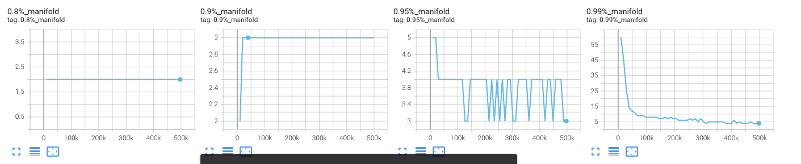
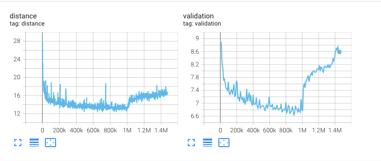
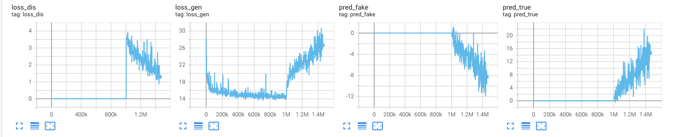

# Weights & Biases guide

Training logs scalars, validation audio, and gin/model summaries to [Weights & Biases](https://wandb.ai). Default project: `brave` (`--wandb_project` on `train.py` / `train_prior.py`).

## Latent space size estimation

During training, RAVE regularly estimates the **size** of the latent space given a specific dataset for a given *fidelity*. The fidelity parameter is a percentage that defines how well the model should be able to reconstruct an input audio sample.

Usually values around 80% yield correct yet not accurate reconstructions. Values around 95% are most of the time sufficient to have both a compact latent space and correct reconstructions.

We log the estimated size of the latent space for several values of fidelity (80, 90, 95 and 99%) as `fidelity_0.8`, `fidelity_0.9`, etc.

## Reconstruction error

The values you should look at for tracking the reconstruction error of the model are **`train/loss_recon`** (and per-distance components in `train/*`) paired with **`val/loss`** (fullband reconstruction sum at validation).

**Headline scalars:** **`train/loss`** matches the generator objective used in `backward()` (logged on generator steps only). **`train/loss_latent`** is the Fader phase-1 latent adversarial term (0 for base BRAVE). Fader attribute metrics live under **`train/fader/*`**.

When the 2 phase kicks in, those values increase — **that's usually normal**.

## Adversarial losses

The `loss_dis`, `loss_gen`, `pred_real`, `pred_fake` losses only appear during the second phase. They are usually harder to read, as most GAN losses are, but we include here an example of what *normal* logs should look like.

## Validation audio

On validation epochs, `audio_val` (main RAVE model) and `generation` (prior) are logged as W&B Audio panels. Gin config and model architecture strings are stored in the run summary as `config` and `model`.
