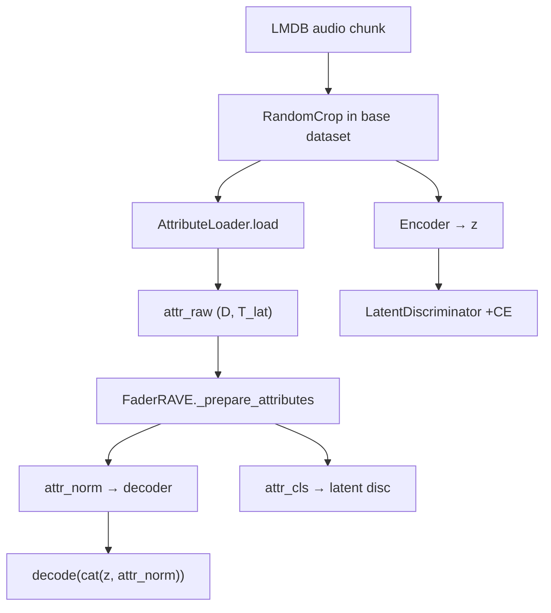

# Fader Networks (`rave.fader`)

Conditional RAVE training: disentangle **content** latent `z` from **control** attributes, then decode with `cat(z, attr_norm)`.

Ported from neurorave FadeRAVE — see module docstrings and [`BRAVE/scratchpaper/fader_future_work.md`](../../../scratchpaper/fader_future_work.md) for project-level history.

## Layout

```
fader/
  README.md                 ← you are here
  model.py                  FaderRAVE (Lightning module)
  attributes.py             normalize, quantify, stats I/O
  dataset.py                FaderAttributeDataset + gin wrap
  latent_discriminator.py   attribute CE on z (phase 1)
  callbacks.py              lambda warmup for adversarial weight
  providers/                where attr_raw comes from
  audio_descriptors/        librosa + timbral feature extractors
  realtime/                 block-wise inference attributes
  export/                   TorchScript FaderTraceModel
```

## Data flow (training)



| Tensor | Shape | Used for |
|--------|-------|----------|
| `z` | `(B, 128, T_lat)` | Content; latent disc tries to remove attribute info from here |
| `attr_norm` | `(B, D, T_lat)` | Decoder concat (continuous in [-1,1], discrete as index→float) |
| `attr_cls` | `(B, D, T_lat)` | Latent CE only (continuous = quantile bins; discrete = class index) |

**Phases:** Phase 1 = latent adversary + recon; Phase 2 = frozen encoder, audio GAN only (no latent `-CE` after warmup).

## Top-level modules

| File | Role |
|------|------|
| [`model.py`](model.py) | `FaderRAVE` — training step, `_prepare_attributes`, stats buffers |
| [`attributes.py`](attributes.py) | `compute_descriptor_matrix`, min/max, bins, `attribute_stats.yaml` |
| [`dataset.py`](dataset.py) | Thin wrapper: audio + `AttributeLoader`; gin `wrap_fader_dataset` |
| [`latent_discriminator.py`](latent_discriminator.py) | Per-attribute CE heads on `z` |
| [`callbacks.py`](callbacks.py) | `LambdaWarmupCallback` ramps `lambda_factor` |

## Configuration (gin)

Load after base RAVE config, e.g. [`BRAVE/configs/brave_fader.gin`](../../../configs/brave_fader.gin):

- `continuous_attributes` / `discrete_attributes` — names and concat order
- `DECODER_LATENT_SIZE` = `128 + D_total`
- `build_attribute_loader` — wires [`providers/`](providers/README.md)

## Scripts (outside this package)

| Script | Purpose |
|--------|---------|
| `RAVE/scripts/precompute_descriptors.py` | Train-split min/max + bin edges → `attribute_stats.yaml` |
| `RAVE/scripts/train.py` | Standard entry; loads stats when Fader enabled |
| `RAVE/scripts/build_lmdb_index_manifest.py` | LMDB index → source path (FSD50k sidecars) |
| `RAVE/scripts/build_attribute_sidecar.py` | e.g. `water_scene` discrete labels |
| `RAVE/scripts/eval_fader_attributes.py` | Objective attribute-swap metrics |
| `RAVE/scripts/export_fader_ts.py` | TorchScript + host JSON |
| `BRAVE/scripts/realtime_fader_demo.py` | Offline WAV demo with attr scaling |

## Subpackages

- [`providers/`](providers/README.md) — pluggable attribute sources (audio, sidecar, cache, stubs)
- [`audio_descriptors/`](audio_descriptors/README.md) — librosa + timbral trajectories
- [`realtime/`](realtime/README.md) — `AttributeStream` for block inference
- [`export/`](export/README.md) — stripped model for `torch.jit.script`

## Design rules

1. **Dataset stays dumb** — only calls `AttributeLoader.load()`; never imports extractors directly.
2. **Swap attributes via gin + YAML** — not by editing `dataset.py`.
3. **Continuous attrs** are computed on the **cropped** waveform (aligned with `RandomCrop`).
4. **Discrete attrs** usually come from `attribute_sidecar.yaml` (clip-level scalars broadcast over `T_lat`).
