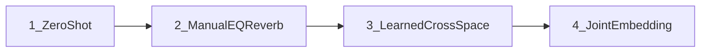

# Domain adaptation narrative

How we move from “play OOD audio into a BRAVE trained on domain Y” toward controllable tap → target timbre transfer.

## 1. Zero-shot BRAVE

Train an unconditional BRAVE on the **target** domain only (e.g. birdsong, water). At inference, feed **source** audio (e.g. body tap) straight into that model: encode → decode with no extra adapter.

- Strength: simplest baseline; same export path as any BRAVE run.
- Failure mode: OOD inputs land off the Y manifold — wrong timbre, ringing, silence/gain quirks.

Docs: [`CLAUDE.md`](../CLAUDE.md) (train/export), [`configs/brave.gin`](../configs/brave.gin).

## 2. Manual domain adaptation

Keep the frozen Y BRAVE. Before encode, hand-tune **EQ / reverb** (and related DSP) so the tap signal better resembles in-domain Y acoustics.

- Strength: interpretable; fast to try on a Max/host path; motivates which cues matter (spectrum, room).
- Failure mode: brittle across players, mics, and gain; no learned content/timbre tradeoff.

This is the conceptual parent of the **waveform** canonicalizer (learned EQ/reverb knobs), later automated in Stage-1.

## 3. Learned input adaptation (cross-space)

Train **two** plain BRAVE codecs (domain X and domain Y). Learn warps that transfer **between** their latent spaces:

| Intent | Path |
|--------|------|
| X → Y | `Enc_X(x) → W_xy → Dec_Y` |
| Y → X | `Enc_Y(y) → W_yx → Dec_X` |

- **Stage-1 canonicalizer** (one-way): freeze Y only; learn a within-Y warp so OOD X reconstructions sound more in-domain ([`docs/canonicalizer/`](canonicalizer/README.md)).
- **CycleGAN Approach 2 (separate)**: freeze both; bidirectional cycle + GAN; warps are **cross-space** with random init ([`docs/cyclegan/`](cyclegan/README.md), [`configs/brave_cyclegan_separate.gin`](../configs/brave_cyclegan_separate.gin)).

- Strength: no hand DSP; bidirectional transfer; reuses frozen AEs.
- Failure mode: \(Z_X \not\approx Z_Y\) as coordinates — harder warps, foreign-manifold AE-aware cycle, dual-ckpt export graph.

## 4. Joint embedding (within-space)

Train **one** BRAVE on \(X \cup Y\) so both domains share a latent \(Z\). Then CycleGAN warps are **within-space** remaps on that shared codec:

| Intent | Path |
|--------|------|
| X → Y | `Enc(x) → W_xy → Dec` |
| Y → X | `Enc(y) → W_yx → Dec` |

Config: [`configs/brave_cyclegan_joint.gin`](../configs/brave_cyclegan_joint.gin). Identity residual init; identity loss is meaningful. Export loads one backbone ([`scratchpaper/joint_embedding_cyclegan.md`](../scratchpaper/joint_embedding_cyclegan.md)).

- Strength: simpler geometry; closer to Stage-1 attach; apples-to-apples vs Approach 2 on the same domains.
- Failure mode: joint AE may be domain-imbalanced; AE-aware cycle no longer acts as a *foreign* codec critic — domain signal shifts to D / identity.

Joint LMDB preprocess: [`scripts/submit_joint_preprocess.sh`](../scripts/submit_joint_preprocess.sh) / [`scripts/preprocess_joint.sbatch`](../scripts/preprocess_joint.sbatch).

---

**Reading order:** zero-shot Y BRAVE → listen with manual EQ/reverb → Stage-1 / separate CycleGAN → joint AE + joint CycleGAN.
